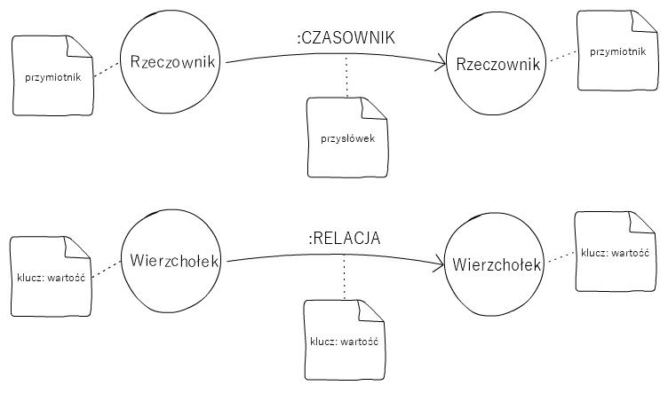
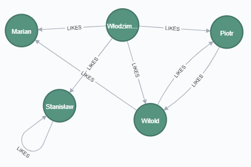

# Grafo(mania)
1. «pisanie utworów literackich przez osoby pozbawione talentu»
2. «bezwartościowe utwory literackie»  
(za [Słownikiem Języka Polskiego](https://sjp.pwn.pl/slowniki/grafomania.html))
3. zamiłowanie do grafów  
(za [autorem](https://www.linkedin.com/in/wlodzimierz-kozlowski/))

### _Wpłynąłem na suchego przestwór oceanu_ czyli o tych, którzy docierają do GraphX

(Prawie) każda prezentacja dotycząca Apache Spark<sup>TM</sup> zaczyna się od wykresu porównującego czas wykonania _Logistic regression in Hadoop and Spark_.
Nad wyższym słupkiem (tym od Hadoopa) widnieje liczba 110, nad niższym, ledwie zauważalnym (tym od Sparka) liczba 0.9. _Run workloads 100x faster._
Potem drugi obrazek - moduły Sparka: cztery ciemnoniebieskie prostokąty. 
Wychodzimy od RDD (_Resilient Distributed Dataset_), potem _Spark SQL_, _Spark Streaming_.
Rzadziej coś konkretnego z _MLib (machine learning)_ - w tym obszarze częściej, szybciej, łatwiej można pooglądać w _Python_ i _Keras_ albo innym _Tensorflow_ czy _PyTorch_.
Tylko nieliczni "zaglądają" do ostatniego klocka _GraphX (graph)_.

A bo grafy to wąskie zastosowanie, a bo API oparte na "starym, niskopoziomowym" RDD (bez DataFrame/Dataset)...
Ten ostatni zarzut można próbować odeprzeć wprowadzając bibliotekę _GraphFrames_ (_GraphX is to RDDs as GraphFrames are to DataFrames._) szczególnie z wykorzystaniem tzw. _motif finding_.
Ten prosty DSL pozwala już na tworzenie pewnych wzorców wyszukiwania np. `(a)-[e]->(b)` czyli wierzchołków `a` i `b` połączonych krawędzią `e`

```scala
import org.graphframes.{examples,GraphFrame}
val g: GraphFrame = examples.Graphs.friends  // get example graph

// Search for pairs of vertices with edges in both directions between them.
val motifs: GraphFrame = g.find("(a)-[e]->(b); (b)-[e2]->(a)")
motifs.show()

// More complex queries can be expressed by applying filters.
motifs.filter("b.age > 30").show()
```
Więcej? [GraphFrames User Guide](https://graphframes.github.io/graphframes/docs/_site/user-guide.html)

Czuć jednak pewien niedosyt a do tego głosy z sali:
- "Nie potrzebuję bazy grafowej bo nie będę pisał kolejnego portalu społecznościowego",
- "Nie budujemy systemu na potrzeby transportu żeby szukać najkrótszych ścieżek".
- "ZG8gZHVweQ=="

a przecież wszystko jest grafem! Relacje między osobami, zakupy, faktury:

```
(a:Osoba)-[:LUBI]->(b:Osoba)
(o:Osoba)-[:KUPILA]->(p:Produkt)
(m:Faktura)-[:ZAWIERA]->(d:PozycjaRozliczenia)<-[:DOTYCZY]-(o:Odczyt)
``` 

I do tego _The whiteboard model is the physical model_. Musimy rozbudować model? Dodać albo zmienić zależności? 
Dodajmy bez tych `ALTER TABLE products ADD CONSTRAINT fk_supplier FOREIGN KEY (supplier_id) REFERENCES supplier(supplier_id);` 

Wszystko jest grafem! Cały świat jest grafem! "Wybuch mózga!" (Chodzi o gwałtowną produkcję któregoś z hormonów, które często przytrafia się dzieciom kiedy muszą iść spać.
Tak to zjawisko nazywa nasz 5-letni syn W***k).

### _Wóz nurza się w zieloność i jak łódka brodzi_ czyli czym jest Cypher

Truizmem jest stwierdzenie, że graf składa się z wierzchołków i krawędzi.
Wierzchołki definiują nam pewien byt (osobę, miejsce, rzecz, kategorię itd.), krawędzie relacje między wierzchołkami czyli jak te wierzchołki są ze sobą połączone ("jestem żonaty z", "mieszkam w", "znam", "lubię", "jestem właścicielem" itd.).
W przypadku bazy Neo4j każdy wierzchołek może mieć wiele etykiet (_label_), które określają jego typ. 
Każdy wierzchołek i krawędź mogą zawierać dodatkowe atrybuty (_properties_) co tworzy nam tzw. _property graph_.
Przekładając opis naszych danych w języku naturalnym na schemat bazy: 
- rzeczownik (_noun_) to etykieta/typ wierzchołka (_label_)
- przymiotnik (_adjective_) to atrybut (_property_) wierzchołka
- czasownik (_verb_) to nazwa relacji
- przysłówek (_adverb_) to atrybut  (_property_) krawędzi



Cypher jest deklaratywnym językiem zapytań, który umożliwia nam wyszukiwanie i modyfikację danych grafowych.
Pierwotnie stworzony na potrzeby bazy [Neo4j](https://neo4j.com/), [lidera w rankingu baz grafowych](https://db-engines.com/en/ranking/graph+dbms), dla wielu praktycznie synonimu takiej bazy.
W skrócie można powiedzieć, że jest "eskuelem dla grafów".
Słowa kluczowe `WHERE` czy `ORDER BY` inspirowane właśnie są przez SQL. Język czerpie także ze SPARQL (_pattern matching_) czy Haskella i Pythona. 
Cypher jest dość intuicyjny i _human-readable_. Z racji tego, że nawiasy okrągłe `()` reprezentują wierzchołki a `-->` krawędzie w opisie przewija się nawet sformułowanie o  _ASCII art_.

Jednym z najprostszych zapytań będzie
```
MATCH (n) RETURN n
```
które zwróci wszystkie wierzchołki `()` w naszym grafie.

```
MATCH (p:Person)
RETURN p
LIMIT 10
```
zwróci tylko wierzchołki typu `Person` (wierzchołki, które mają określoną etykietę `Person`) i zawęzi wynik do 10 elementów.
```
MATCH (p:Person { born: 1970 })
RETURN p
```
to osoby urodzone w 1970 r. (atrybut `born` jest równy `1970`). \
Bardziej skomplikowane warunki wymagają wprowadzenia klauzuli `WHERE`
```
MATCH (p:Person)
WHERE p.born >= 1970 AND p.name STARTS WITH 'Paul'
RETURN p
```
Istotą grafu są jednak relacje.
```
MATCH (p:Person)-[:ACTED_IN]->(:Movie {title: 'The Matrix'})
RETURN p.name
```
to nazwiska (zwracamy jedynie atrybut `name` a nie cały wierzchołek) osób, które zagrały (relacja `ACTED_IN`) w filmie (wierzchołek typu `Movie`) pod tytułem "The Matrix" (wartość atrybutu `title`).  
Aktorzy to nie jedyne osoby, które są związane z danym filmem. Są jeszcze producenci, reżyserzy... - istnieją zatem różne relacje łączące wierzchołki typu `Person` i `Movie`.
```
MATCH (p:Person)-[r]->(m:Movie)
RETURN p.name, type(r), m.title
``` 
A jeśli interesuje nas lista (`collect`) reżyserów (relacja `DIRECTED`) określonego filmu?
```
MATCH (p:Person)-[r:DIRECTED]->(m:Movie)
WHERE m.title = 'The Matrix'
RETURN m.title, collect(p.name)
```

Więcej? [Introduction to Neo4j Online Course and Tutorial](https://neo4j.com/graphacademy/online-training/introduction-to-neo4j/)

### _Patrzę w niebo, gwiazd szukam, przewodniczek łodzi_ czyli o nowości(ach) w Spark 3.0
Gdzieś na horyzoncie [majaczy już Spark 3.0](https://spark.apache.org/news/spark-3.0.0-preview.html).
Coś staje się "deprecated", ktoś twierdzi że będzie 17x szybszy (teraz ten niższy słupek już w ogóle będzie niezauważalny).  
Jednym z przegłosowanych już propozycji tzw. _Spark Project Improvement Proposal (SPIP)_ jest realizacja [Property Graphs, Cypher Queries, and Algorithms](https://issues.apache.org/jira/browse/SPARK-25994).

> The idea is to define a Cypher-compatible Property Graph type based on DataFrames; to replace GraphFrames querying with Cypher; to reimplement GraphX/GraphFrames algos on the PropertyGraph type.

Spróbujmy zatem skorzystać z mocy silnika Spark i elegancji języka Cypher w nowej odsłonie zwanej _Spark Graph_ (w oparciu o projekt [Morpheus](https://github.com/opencypher/morpheus))

### _Słyszę, kędy się motyl kołysa na trawie_ czyli coś się wykona...

Na potrzeby demo zdefiniujmy abstrakcyjny zbiór pracowników (wierzchołki z etykietą `Employee`) o abstrakcyjnych danych (atrybuty `name` i `salary`) i równie abstrakcyjnych relacjach między nimi (`LIKES` z atrybutem `rating` od 1 do 5).



Teraz już tylko nasz program, z jakżeż pięknymi (za)pytaniami, które sobie stawiamy...

```scala
package pl.cafebabe.spark

import org.opencypher.morpheus.api.MorpheusSession
import org.opencypher.morpheus.api.io.{MorpheusNodeTable, MorpheusRelationshipTable}
import org.opencypher.okapi.api.graph.PropertyGraph

object CypherExample {

  def main(args: Array[String]): Unit = {
    implicit val morpheus: MorpheusSession = MorpheusSession.local()
    val spark = morpheus.sparkSession

    import spark.sqlContext.implicits._

    // dataframe, z których utworzymy wierzchołki i krawędzie
    // oczywiście w praktyce pobierzemy je np. z pliku (HDFS, S3), bazy danych (może relacyjnej) albo bezpośrednio z neo4j
    val employeesDF = spark.createDataset(Seq(
      (0L, "Marian", 32000),
      (1L, "Włodzimierz", 4000),
      (2L, "Piotr", 5099),
      (3L, "Witold", 21000),
      (4L, "Stanisław", 23000)
    )).toDF("id", "name", "salary")
    val likesDF = spark.createDataset(Seq(
      (0L, 1L, 0L, 5),
      (1L, 1L, 2L, 5),
      (2L, 1L, 3L, 5),
      (3L, 1L, 4L, 5),
      (4L, 2L, 3L, 4),
      (5L, 3L, 2L, 4),
      (6L, 3L, 0L, 5),
      (7L, 4L, 4L, 6)
    )).toDF("id", "source", "target", "rating")

    // wierzchołki typu (z etykietą) Employee
    val employees = MorpheusNodeTable(Set("Employee"), employeesDF)
    // krawędzie (relacje) typu :LIKES
    val likes = MorpheusRelationshipTable("LIKES", likesDF)

    // utworzenie grafu
    val graph: PropertyGraph = morpheus.readFrom(employees, likes)

    println("kto z kim się lubi?")
    val result1 = graph.cypher(
      """
        |MATCH (a:Employee)-[:LIKES]->(b:Employee)
        |RETURN a.name, collect(b.name)
        |""".stripMargin)
    result1.show

    println("pracownicy, którzy niewiele zarabiają ale bardzo lubią Witolda")
    graph.cypher(
      """
        |MATCH (a:Employee)-[r:LIKES]->(b:Employee)
        |WHERE a.salary < 5200 AND b.name = 'Witold' and r.rating >= 4
        |RETURN a.name, a.salary, r.rating
        |""".stripMargin)
      .show
  }

}
```

... i otrzymanymi odpowiedziami jako wynik wykonania!

```
kto z kim się lubi?
╔═══════════════╤════════════════════════════════════════════╗
║ a.name        │ collect(b.name)                            ║
╠═══════════════╪════════════════════════════════════════════╣
║ 'Witold'      │ ['Piotr', 'Marian']                        ║
║ 'Włodzimierz' │ ['Marian', 'Piotr', 'Witold', 'Stanisław'] ║
║ 'Piotr'       │ ['Witold']                                 ║
║ 'Stanisław'   │ ['Stanisław']                              ║
╚═══════════════╧════════════════════════════════════════════╝
(4 rows)
pracownicy, którzy niewiele zarabiają ale bardzo lubią Witolda
╔═══════════════╤══════════╤══════════╗
║ a.name        │ a.salary │ r.rating ║
╠═══════════════╪══════════╪══════════╣
║ 'Włodzimierz' │ 4000     │ 5        ║
║ 'Piotr'       │ 5099     │ 4        ║
╚═══════════════╧══════════╧══════════╝
(2 rows)
```

### _Jedźmy, nikt nie woła_ czyli podsumowanie...  
Apache Spark jest obecnie w wersji `3.0.0-preview2` a [Issue SPARK-25994](https://issues.apache.org/jira/browse/SPARK-25994) ma status `OPEN`.  
Może jednak w niedługiej przyszłości prezentacje będą już wyglądały inaczej.

##### @author
Włodzimierz Kozłowski  
wlodzimierz.kozlowski@asseco.pl  
Starszy Projektant  
Pion Energetyki i Gazownictwa  
Asseco Poland S.A.  

[Neo4j Certified Professional](https://graphacademy.neo4j.com/certificates/51318db54846d58e863d234357d35a419af770bcfd969a76bfdccde263739464.pdf)
